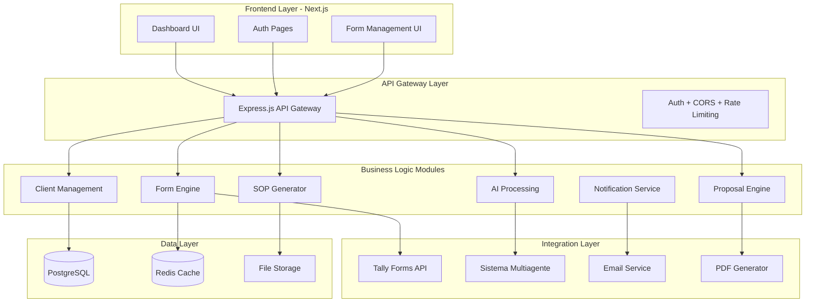

# 🏗️ ARQUITECTURA TÉCNICA COMPLETA
## Sistema de Levantamiento Automatizado de Procesos Empresariales

**Arquitecto:** Solutions Architect - Claude Code  
**Fecha:** 2025-08-05  
**Versión:** 1.0.0  
**Basado en:** 68 reglas de negocio identificadas del PRD  

---

## 📋 RESUMEN EJECUTIVO

### **Contexto del Sistema**
Sistema de consultoría que automatiza diagnósticos empresariales mediante formularios adaptativos y procesamiento IA, integrando crítico con Tally Forms API y sistema multiagente existente para generar SOPs estructurados.

### **Volumen y Performance Targets**
- **Escala:** 50+ clientes/mes, 200 formularios completados/mes
- **Crecimiento:** 100% anual proyectado (preparado para 10X)
- **Performance:** <3s consultas, <30s generación formularios, <2min procesamiento IA
- **Disponibilidad:** 99% uptime con 4h RTO, 24h RPO

### **Stack Tecnológico Core**
- **Frontend:** Next.js 14 + TypeScript + Tailwind + shadcn/ui
- **Backend:** Node.js + Express + Prisma ORM
- **Database:** PostgreSQL (Supabase) + Redis (cache/sessions)
- **Hosting:** Vercel (Frontend) + Railway (Backend) + Supabase (DB)
- **Integraciones:** Tally Forms API + Sistema Multiagente + Email/PDF

---

## 🏛️ ARQUITECTURA MODULAR DE ALTO NIVEL

### **Patrón Arquitectónico: Modular Monolith + Event-Driven**
```yaml
arquitectura:
  tipo: "Modular Monolith con Event-Driven Components"
  patron_principal: "Clean Architecture + Domain-Driven Design"
  escalabilidad: "Preparada para microservicios migration"
  
principios_design:
  - "Separation of Concerns por dominio de negocio"
  - "Single Responsibility por módulo funcional"
  - "Dependency Inversion para integraciones externas"
  - "Event-Driven para comunicación inter-módulos"
  - "API-First design para futuras integraciones"
```

### **Módulos Core del Sistema**


---

## 🗃️ DATABASE SCHEMA OPTIMIZADO

### **Diseño Optimizado para 68 Reglas de Negocio**

```sql
-- ==============================================
-- CLIENTE MANAGEMENT DOMAIN
-- ==============================================

-- Tabla principal de clientes
CREATE TABLE clients (
    id UUID PRIMARY KEY DEFAULT gen_random_uuid(),
    name VARCHAR(255) NOT NULL,
    industry_id UUID NOT NULL REFERENCES industries(id),
    subindustry VARCHAR(100),
    company_size ENUM('micro', 'small', 'medium', 'large') NOT NULL,
    years_operation INTEGER,
    employee_count INTEGER,
    annual_revenue DECIMAL(12,2),
    
    -- Clasificación automática IA
    classification_confidence DECIMAL(3,2), -- 0.00-1.00
    classification_timestamp TIMESTAMP,
    
    -- Estado del proceso
    current_status ENUM(
        'created', 
        'form_sent', 
        'responses_received', 
        'processing_ai', 
        'sops_generated', 
        'proposal_ready', 
        'proposal_sent', 
        'closed'
    ) DEFAULT 'created',
    
    -- Metadatos
    created_at TIMESTAMP DEFAULT NOW(),
    updated_at TIMESTAMP DEFAULT NOW(),
    created_by UUID REFERENCES users(id),
    
    -- Índices optimizados
    INDEX idx_clients_industry (industry_id),
    INDEX idx_clients_status (current_status),
    INDEX idx_clients_created (created_at DESC)
);

-- ==============================================
-- INDUSTRIES & KNOWLEDGE BASE
-- ==============================================

-- Base de conocimiento de industrias
CREATE TABLE industries (
    id UUID PRIMARY KEY DEFAULT gen_random_uuid(),
    code VARCHAR(50) UNIQUE NOT NULL, -- 'accounting', 'real_estate', etc.
    name VARCHAR(100) NOT NULL,
    display_name_es VARCHAR(100) NOT NULL,
    
    -- Configuración de formularios
    is_regulated BOOLEAN DEFAULT FALSE,
    additional_compliance_questions INTEGER DEFAULT 0,
    
    -- Procesos típicos de la industria
    typical_processes JSON, -- Array de procesos estándar
    common_pain_points JSON, -- Pain points frecuentes
    automation_benchmarks JSON, -- Benchmarks típicos
    
    -- Control de versiones
    version INTEGER DEFAULT 1,
    is_active BOOLEAN DEFAULT TRUE,
    created_at TIMESTAMP DEFAULT NOW()
);

-- Templates de preguntas por industria + tamaño
CREATE TABLE question_templates (
    id UUID PRIMARY KEY DEFAULT gen_random_uuid(),
    industry_id UUID REFERENCES industries(id),
    company_size ENUM('micro', 'small', 'medium', 'large'),
    
    -- Contenido de preguntas
    questions JSON NOT NULL, -- Array de preguntas específicas
    question_count INTEGER NOT NULL,
    estimated_completion_time INTEGER, -- minutos
    
    -- Reglas de negocio embebidas
    priority_order INTEGER,
    compliance_questions JSON, -- Preguntas adicionales si es regulada
    
    -- Metadatos
    version INTEGER DEFAULT 1,
    is_active BOOLEAN DEFAULT TRUE,
    created_at TIMESTAMP DEFAULT NOW(),
    
    -- Constraints de las reglas de negocio
    CONSTRAINT chk_question_count_by_size CHECK (
        (company_size = 'micro' AND question_count BETWEEN 15 AND 20) OR
        (company_size = 'small' AND question_count BETWEEN 20 AND 25) OR
        (company_size = 'medium' AND question_count BETWEEN 25 AND 30) OR
        (company_size = 'large' AND question_count BETWEEN 30 AND 40)
    ),
    
    UNIQUE(industry_id, company_size, version)
);

-- ==============================================
-- FORM MANAGEMENT DOMAIN
-- ==============================================

-- Formularios generados vía Tally API
CREATE TABLE generated_forms (
    id UUID PRIMARY KEY DEFAULT gen_random_uuid(),
    client_id UUID NOT NULL REFERENCES clients(id),
    
    -- Integración Tally Forms
    tally_form_id VARCHAR(100) UNIQUE NOT NULL,
    tally_form_url TEXT NOT NULL,
    tally_webhook_url TEXT,
    
    -- Configuración del formulario
    industry_id UUID REFERENCES industries(id),
    company_size ENUM('micro', 'small', 'medium', 'large'),
    question_template_id UUID REFERENCES question_templates(id),
    total_questions INTEGER,
    
    -- Estado y timing
    status ENUM('created', 'sent', 'in_progress', 'completed', 'expired') DEFAULT 'created',
    sent_at TIMESTAMP,
    started_at TIMESTAMP,
    completed_at TIMESTAMP,
    expires_at TIMESTAMP,
    
    -- Tracking de progreso
    current_question INTEGER DEFAULT 0,
    completion_percentage DECIMAL(5,2) DEFAULT 0.00,
    
    -- Persistencia parcial (guardado)
    partial_responses JSON,
    last_saved_at TIMESTAMP,
    
    created_at TIMESTAMP DEFAULT NOW(),
    
    -- Índices para performance
    INDEX idx_forms_client (client_id),
    INDEX idx_forms_status (status),
    INDEX idx_forms_tally_id (tally_form_id)
);

-- Respuestas de formularios recibidas
CREATE TABLE form_responses (
    id UUID PRIMARY KEY DEFAULT gen_random_uuid(),
    form_id UUID NOT NULL REFERENCES generated_forms(id),
    client_id UUID NOT NULL REFERENCES clients(id),
    
    -- Datos completos de respuestas
    raw_responses JSON NOT NULL, -- Respuestas tal como vienen de Tally
    processed_responses JSON, -- Respuestas procesadas y estructuradas
    
    -- Metadatos de completado
    completion_time_minutes INTEGER,
    submitted_at TIMESTAMP NOT NULL,
    ip_address INET,
    user_agent TEXT,
    
    -- Validación de calidad
    validation_score DECIMAL(3,2), -- Score de calidad de respuestas
    validation_issues JSON, -- Issues detectados
    
    created_at TIMESTAMP DEFAULT NOW(),
    
    -- Constraint único por formulario
    UNIQUE(form_id),
    INDEX idx_responses_client (client_id),
    INDEX idx_responses_submitted (submitted_at DESC)
);

-- ==============================================
-- AI PROCESSING DOMAIN
-- ==============================================

-- Jobs de procesamiento IA
CREATE TABLE ai_processing_jobs (
    id UUID PRIMARY KEY DEFAULT gen_random_uuid(),
    client_id UUID NOT NULL REFERENCES clients(id),
    form_response_id UUID NOT NULL REFERENCES form_responses(id),
    
    -- Estado del procesamiento
    status ENUM('queued', 'processing', 'completed', 'failed', 'retrying') DEFAULT 'queued',
    
    -- Configuración de procesamiento
    multiagent_system_config JSON, -- Config específica para el sistema multiagente
    industry_context JSON, -- Contexto de industria para el procesamiento
    
    -- Timing y performance
    started_at TIMESTAMP,
    completed_at TIMESTAMP,
    processing_time_seconds INTEGER,
    
    -- Resultados
    identified_processes JSON, -- Procesos identificados por IA
    process_count INTEGER,
    confidence_scores JSON, -- Scores de confianza por proceso
    
    -- Control de errores
    retry_count INTEGER DEFAULT 0,
    error_message TEXT,
    error_details JSON,
    
    created_at TIMESTAMP DEFAULT NOW(),
    
    -- Constraints de calidad (RN3: mínimo 5 procesos)
    CONSTRAINT chk_min_processes CHECK (
        status != 'completed' OR process_count >= 5
    ),
    
    INDEX idx_ai_jobs_status (status),
    INDEX idx_ai_jobs_client (client_id)
);

-- ==============================================
-- SOP GENERATION DOMAIN
-- ==============================================

-- Procesos identificados
CREATE TABLE identified_processes (
    id UUID PRIMARY KEY DEFAULT gen_random_uuid(),
    client_id UUID NOT NULL REFERENCES clients(id),
    ai_job_id UUID NOT NULL REFERENCES ai_processing_jobs(id),
    
    -- Clasificación del proceso (RN1 de RF003)
    process_name VARCHAR(255) NOT NULL,
    process_category ENUM('primary', 'support', 'management') NOT NULL,
    
    -- Características del proceso
    is_explicit BOOLEAN NOT NULL, -- Explícito vs implícito en respuestas
    frequency_per_month INTEGER,
    manual_steps_count INTEGER,
    error_rate_percentage DECIMAL(5,2),
    
    -- Datos para automatización
    automation_feasibility_score DECIMAL(3,2), -- 0.00-1.00
    estimated_roi_percentage INTEGER,
    implementation_complexity ENUM('low', 'medium', 'high'),
    
    -- Sistemas involucrados
    systems_involved JSON, -- Array de sistemas que toca el proceso
    integration_complexity ENUM('low', 'medium', 'high'),
    
    created_at TIMESTAMP DEFAULT NOW(),
    
    INDEX idx_processes_client (client_id),
    INDEX idx_processes_category (process_category),
    INDEX idx_processes_automation_score (automation_feasibility_score DESC)
);

-- SOPs generados estructurados
CREATE TABLE generated_sops (
    id UUID PRIMARY KEY DEFAULT gen_random_uuid(),
    process_id UUID NOT NULL REFERENCES identified_processes(id),
    client_id UUID NOT NULL REFERENCES clients(id),
    
    -- Estructura estándar del SOP (RN2 de RF003)
    objective TEXT NOT NULL,
    responsible_roles JSON NOT NULL, -- Array de roles responsables
    inputs JSON NOT NULL, -- Inputs necesarios
    steps JSON NOT NULL, -- Pasos detallados
    outputs JSON NOT NULL, -- Outputs generados
    
    -- Metadata del SOP
    estimated_duration_minutes INTEGER,
    complexity_level ENUM('low', 'medium', 'high'),
    compliance_requirements JSON, -- Si aplica para industrias reguladas
    
    -- Validación de calidad (RN1 de reglas de validación)
    has_objective BOOLEAN GENERATED ALWAYS AS (objective IS NOT NULL AND LENGTH(objective) > 10) STORED,
    has_responsible BOOLEAN GENERATED ALWAYS AS (JSON_ARRAY_LENGTH(responsible_roles) >= 1) STORED,
    has_min_steps BOOLEAN GENERATED ALWAYS AS (JSON_ARRAY_LENGTH(steps) >= 3) STORED,
    has_inputs_outputs BOOLEAN GENERATED ALWAYS AS (JSON_ARRAY_LENGTH(inputs) >= 1 AND JSON_ARRAY_LENGTH(outputs) >= 1) STORED,
    
    -- Control de versiones
    version INTEGER DEFAULT 1,
    is_approved BOOLEAN DEFAULT FALSE,
    approved_at TIMESTAMP,
    approved_by UUID REFERENCES users(id),
    
    created_at TIMESTAMP DEFAULT NOW(),
    
    -- Constraint de calidad mínima
    CONSTRAINT chk_sop_quality CHECK (
        has_objective AND has_responsible AND has_min_steps AND has_inputs_outputs
    ),
    
    -- Alert para SOPs complejos (RN3 de validación)
    CONSTRAINT chk_steps_count CHECK (
        JSON_ARRAY_LENGTH(steps) <= 20 OR 
        (JSON_ARRAY_LENGTH(steps) > 20 AND complexity_level = 'high')
    ),
    
    INDEX idx_sops_client (client_id),
    INDEX idx_sops_process (process_id)
);

-- ==============================================
-- PROPOSAL GENERATION DOMAIN
-- ==============================================

-- Análisis de automatización por cliente
CREATE TABLE automation_analysis (
    id UUID PRIMARY KEY DEFAULT gen_random_uuid(),
    client_id UUID NOT NULL REFERENCES clients(id),
    
    -- Matriz de priorización automática
    quick_wins JSON, -- Procesos 0-3 meses (ROI >300%)
    medium_term JSON, -- Procesos 3-6 meses
    complex_projects JSON, -- Procesos 6+ meses
    
    -- Métricas globales
    total_processes_analyzed INTEGER,
    high_priority_count INTEGER,
    estimated_total_roi_percentage INTEGER,
    total_implementation_cost_usd DECIMAL(10,2),
    
    -- Reglas de priorización aplicadas (RN de matriz_automatizacion)
    high_volume_processes JSON, -- >100 transacciones/mes + >10 pasos
    high_error_processes JSON, -- >5% tasa error
    complex_integration_processes JSON, -- >3 sistemas
    compliance_critical_processes JSON, -- Forzar alta prioridad
    
    created_at TIMESTAMP DEFAULT NOW(),
    
    -- Constraint de calidad mínima
    CONSTRAINT chk_analysis_quality CHECK (
        total_processes_analyzed >= 5
    ),
    
    INDEX idx_analysis_client (client_id)
);

-- Propuestas comerciales generadas
CREATE TABLE commercial_proposals (
    id UUID PRIMARY KEY DEFAULT gen_random_uuid(),
    client_id UUID NOT NULL REFERENCES clients(id),
    automation_analysis_id UUID NOT NULL REFERENCES automation_analysis(id),
    
    -- Contenido de la propuesta
    executive_summary TEXT,
    identified_opportunities JSON,
    implementation_roadmap JSON,
    investment_breakdown JSON,
    expected_roi JSON,
    
    -- Archivos generados
    pdf_file_path TEXT,
    pdf_generated_at TIMESTAMP,
    
    -- Estado de la propuesta
    status ENUM('draft', 'ready', 'sent', 'accepted', 'rejected') DEFAULT 'draft',
    sent_at TIMESTAMP,
    client_feedback TEXT,
    
    -- Métricas de conversión
    opened_at TIMESTAMP,
    download_count INTEGER DEFAULT 0,
    
    created_at TIMESTAMP DEFAULT NOW(),
    
    INDEX idx_proposals_client (client_id),
    INDEX idx_proposals_status (status)
);

-- ==============================================
-- NOTIFICATION & WORKFLOW DOMAIN
-- ==============================================

-- Sistema de notificaciones automáticas
CREATE TABLE notifications (
    id UUID PRIMARY KEY DEFAULT gen_random_uuid(),
    client_id UUID REFERENCES clients(id),
    
    -- Tipo y contenido
    notification_type ENUM(
        'form_sent',
        'form_reminder',
        'form_completed',
        'processing_started',
        'sops_ready',
        'proposal_ready',
        'error_alert'
    ) NOT NULL,
    
    recipient_email VARCHAR(255) NOT NULL,
    subject VARCHAR(500),
    message TEXT,
    
    -- Estado de envío
    status ENUM('pending', 'sent', 'failed', 'bounced') DEFAULT 'pending',
    sent_at TIMESTAMP,
    
    -- Configuración
    is_automated BOOLEAN DEFAULT TRUE,
    retry_count INTEGER DEFAULT 0,
    
    created_at TIMESTAMP DEFAULT NOW(),
    
    INDEX idx_notifications_status (status),
    INDEX idx_notifications_type (notification_type)
);

-- Workflow state transitions tracking
CREATE TABLE workflow_transitions (
    id UUID PRIMARY KEY DEFAULT gen_random_uuid(),
    client_id UUID NOT NULL REFERENCES clients(id),
    
    -- Transición de estado
    from_status VARCHAR(50),
    to_status VARCHAR(50) NOT NULL,
    
    -- Contexto de cambio
    trigger_event VARCHAR(100), -- 'webhook_received', 'manual_action', etc.
    triggered_by UUID REFERENCES users(id),
    
    -- Metadata
    additional_data JSON,
    processing_time_ms INTEGER,
    
    created_at TIMESTAMP DEFAULT NOW(),
    
    INDEX idx_transitions_client (client_id),
    INDEX idx_transitions_status (to_status)
);

-- ==============================================
-- SISTEMA DE USUARIOS Y AUTENTICACIÓN
-- ==============================================

CREATE TABLE users (
    id UUID PRIMARY KEY DEFAULT gen_random_uuid(),
    email VARCHAR(255) UNIQUE NOT NULL,
    name VARCHAR(255) NOT NULL,
    
    -- Roles granulares
    role ENUM('admin', 'senior_consultant', 'consultant', 'client') NOT NULL,
    
    -- Autenticación
    password_hash VARCHAR(255), -- NULL para SSO users
    email_verified BOOLEAN DEFAULT FALSE,
    two_factor_enabled BOOLEAN DEFAULT FALSE,
    
    -- Profile
    avatar_url TEXT,
    timezone VARCHAR(50) DEFAULT 'America/Santiago',
    language VARCHAR(5) DEFAULT 'es',
    
    -- Estado
    is_active BOOLEAN DEFAULT TRUE,
    last_login_at TIMESTAMP,
    
    created_at TIMESTAMP DEFAULT NOW(),
    updated_at TIMESTAMP DEFAULT NOW(),
    
    INDEX idx_users_email (email),
    INDEX idx_users_role (role)
);

-- ==============================================
-- AUDITORIA Y COMPLIANCE LGPD
-- ==============================================

-- Audit log para compliance
CREATE TABLE audit_logs (
    id UUID PRIMARY KEY DEFAULT gen_random_uuid(),
    
    -- Qué acción
    action VARCHAR(100) NOT NULL, -- 'create_client', 'access_data', etc.
    entity_type VARCHAR(50), -- 'client', 'form_response', etc.
    entity_id UUID,
    
    -- Quién y cuándo
    user_id UUID REFERENCES users(id),
    ip_address INET,
    user_agent TEXT,
    
    -- Detalles
    details JSON,
    sensitive_data_accessed BOOLEAN DEFAULT FALSE,
    
    created_at TIMESTAMP DEFAULT NOW(),
    
    INDEX idx_audit_action (action),
    INDEX idx_audit_entity (entity_type, entity_id),
    INDEX idx_audit_user (user_id),
    INDEX idx_audit_created (created_at DESC)
);

-- GDPR/LGPD data processing records
CREATE TABLE data_processing_records (
    id UUID PRIMARY KEY DEFAULT gen_random_uuid(),
    client_id UUID NOT NULL REFERENCES clients(id),
    
    -- Consentimiento
    consent_given BOOLEAN NOT NULL,
    consent_date TIMESTAMP NOT NULL,
    consent_type VARCHAR(100), -- 'form_completion', 'commercial_proposal'
    
    -- Propósito del procesamiento
    processing_purpose TEXT NOT NULL,
    legal_basis VARCHAR(100), -- 'consent', 'legitimate_interest'
    
    -- Retención de datos
    retention_period_months INTEGER,
    scheduled_deletion_date DATE,
    
    -- Estado
    is_active BOOLEAN DEFAULT TRUE,
    withdrawn_at TIMESTAMP,
    
    created_at TIMESTAMP DEFAULT NOW(),
    
    INDEX idx_processing_client (client_id),
    INDEX idx_processing_deletion (scheduled_deletion_date)
);

-- ==============================================
-- PERFORMANCE MONITORING
-- ==============================================

-- Métricas de performance del sistema
CREATE TABLE system_metrics (
    id UUID PRIMARY KEY DEFAULT gen_random_uuid(),
    
    -- Tipo de métrica
    metric_type ENUM(
        'form_generation_time',
        'ai_processing_time',
        'sop_generation_time',
        'pdf_generation_time',
        'api_response_time'
    ) NOT NULL,
    
    -- Valores
    value_ms INTEGER NOT NULL,
    client_id UUID REFERENCES clients(id),
    
    -- Contexto
    additional_context JSON,
    
    created_at TIMESTAMP DEFAULT NOW(),
    
    INDEX idx_metrics_type (metric_type),
    INDEX idx_metrics_created (created_at DESC)
);
```

---

## 🔌 API CONTRACTS DETALLADOS

### **API Gateway Structure**
```typescript
// ==============================================
// CLIENT MANAGEMENT API CONTRACTS
// ==============================================

// POST /api/clients - Crear nuevo cliente
interface CreateClientRequest {
  name: string;
  industry: string; // Código de industria
  companySize: 'micro' | 'small' | 'medium' | 'large';
  yearsOperation?: number;
  employeeCount?: number;
  annualRevenue?: number;
  contactEmail: string;
}

interface CreateClientResponse {
  success: boolean;
  data: {
    clientId: string;
    classification: {
      industry: IndustryInfo;
      confidence: number;
      predefinedAnalysis: ProcessAnalysis[];
    };
    nextSteps: {
      formGeneration: boolean;
      estimatedQuestions: number;
      completionTime: number; // minutos
    };
  };
}

// GET /api/clients/{id} - Obtener cliente completo
interface GetClientResponse {
  success: boolean;
  data: {
    client: ClientInfo;
    currentStatus: WorkflowStatus;
    form?: FormInfo;
    processes?: ProcessInfo[];
    sops?: SOPInfo[];
    proposal?: ProposalInfo;
    timeline: TimelineEvent[];
  };
}

// ==============================================
// FORM ENGINE API CONTRACTS
// ==============================================

// POST /api/forms/generate - Generar formulario vía Tally API
interface GenerateFormRequest {
  clientId: string;
  forceRegenerate?: boolean;
}

interface GenerateFormResponse {
  success: boolean;
  data: {
    formId: string;
    tallyFormId: string;
    publicUrl: string;
    questionCount: number;
    estimatedTime: number;
    expiresAt: string;
    webhookConfigured: boolean;
  };
  errors?: string[];
}

// POST /api/forms/webhook - Webhook de Tally Forms
interface TallyWebhookPayload {
  eventId: string;
  eventType: 'form.completed' | 'form.started' | 'form.updated';
  formId: string;
  submissionId: string;
  data: {
    responses: TallyFormResponse[];
    metadata: {
      submittedAt: string;
      completionTime: number;
      ipAddress: string;
      userAgent: string;
    };
  };
}

// GET /api/forms/{id}/status - Estado del formulario
interface FormStatusResponse {
  success: boolean;
  data: {
    status: 'created' | 'sent' | 'in_progress' | 'completed' | 'expired';
    progress: {
      currentQuestion: number;
      totalQuestions: number;
      completionPercentage: number;
    };
    timing: {
      sentAt?: string;
      startedAt?: string;
      lastActivityAt?: string;
      completedAt?: string;
    };
  };
}

// ==============================================
// AI PROCESSING API CONTRACTS
// ==============================================

// POST /api/ai/process - Trigger procesamiento IA
interface ProcessAIRequest {
  clientId: string;
  formResponseId: string;
  priority?: 'low' | 'normal' | 'high';
  config?: {
    industryContext: object;
    customPrompts?: string[];
  };
}

interface ProcessAIResponse {
  success: boolean;
  data: {
    jobId: string;
    estimatedDuration: number; // segundos
    queuePosition: number;
    webhookUrl?: string; // Para notificación cuando complete
  };
}

// GET /api/ai/jobs/{id} - Estado del procesamiento
interface AIJobStatusResponse {
  success: boolean;
  data: {
    jobId: string;
    status: 'queued' | 'processing' | 'completed' | 'failed' | 'retrying';
    progress: {
      currentStep: string;
      percentage: number;
    };
    timing: {
      queuedAt: string;
      startedAt?: string;
      completedAt?: string;
      processingTime?: number;
    };
    results?: {
      processCount: number;
      confidenceScore: number;
      identifiedProcesses: ProcessSummary[];
    };
    error?: {
      message: string;
      retryCount: number;
      nextRetryAt?: string;
    };
  };
}

// ==============================================
// SOP GENERATION API CONTRACTS
// ==============================================

// GET /api/sops/client/{clientId} - SOPs por cliente
interface ClientSOPsResponse {
  success: boolean;
  data: {
    client: ClientSummary;
    totalProcesses: number;
    sops: SOPInfo[];
    categorization: {
      primary: SOPInfo[];
      support: SOPInfo[];
      management: SOPInfo[];
    };
    qualityMetrics: {
      averageComplexity: string;
      completenessScore: number;
      approvalRate: number;
    };
  };
}

// PUT /api/sops/{id} - Actualizar SOP
interface UpdateSOPRequest {
  objective?: string;
  responsibleRoles?: string[];
  inputs?: SOPInput[];
  steps?: SOPStep[];
  outputs?: SOPOutput[];
  approved?: boolean;
  notes?: string;
}

// ==============================================
// PROPOSAL ENGINE API CONTRACTS
// ==============================================

// POST /api/proposals/generate - Generar propuesta comercial
interface GenerateProposalRequest {
  clientId: string;
  includeROIAnalysis: boolean;
  customizations?: {
    executiveSummary?: string;
    priorityAdjustments?: ProcessPriorityAdjustment[];
    budgetConstraints?: BudgetConstraint[];
  };
}

interface GenerateProposalResponse {
  success: boolean;
  data: {
    proposalId: string;
    analysisId: string;
    summary: {
      totalProcesses: number;
      quickWins: number;
      mediumTerm: number;
      complexProjects: number;
      estimatedROI: number;
      totalInvestment: number;
    };
    roadmap: ImplementationPhase[];
    pdfGeneration: {
      queued: boolean;
      estimatedTime: number;
    };
  };
}

// GET /api/proposals/{id}/pdf - Descargar PDF
// Returns: application/pdf file stream

// ==============================================
// INTEGRATION CONTRACTS
// ==============================================

// Contrato para Sistema Multiagente Existente
interface MultiAgentSystemRequest {
  requestId: string;
  clientContext: {
    industry: string;
    companySize: string;
    responses: FormResponse[];
  };
  processingConfig: {
    analysisDepth: 'standard' | 'deep';
    focusAreas: string[];
    outputFormat: 'structured' | 'detailed';
  };
}

interface MultiAgentSystemResponse {
  requestId: string;
  status: 'success' | 'error';
  results: {
    identifiedProcesses: {
      name: string;
      category: 'primary' | 'support' | 'management';
      description: string;
      currentState: string;
      painPoints: string[];
      automationOpportunities: string[];
      confidenceScore: number;
    }[];
    businessInsights: {
      industryBenchmarks: object;
      improvementAreas: string[];
      riskFactors: string[];
    };
    recommendations: {
      quickWins: ProcessRecommendation[];
      strategicInitiatives: ProcessRecommendation[];
    };
  };
  processing: {
    duration: number;
    agentsUsed: string[];
    qualityScore: number;
  };
}

// Contrato para Email Service
interface EmailNotificationRequest {
  to: string[];
  cc?: string[];
  template: 'form_sent' | 'form_reminder' | 'processing_complete' | 'proposal_ready';
  variables: {
    clientName: string;
    formUrl?: string;
    proposalUrl?: string;
    [key: string]: any;
  };
  scheduling?: {
    sendAt: string;
    timezone: string;
  };
}
```

---

## 🏗️ SERVICE LAYERS CON CLEAN ARCHITECTURE

### **Estructura de Capas**
```typescript
// ==============================================
// DOMAIN LAYER - Entities & Business Rules
// ==============================================

// Domain/Entities/Client.ts
export class Client {
  private constructor(
    public readonly id: ClientId,
    public readonly name: string,
    public readonly industry: Industry,
    public readonly companySize: CompanySize,
    private _status: ClientStatus,
    private _classification: ClientClassification
  ) {}

  // Reglas de negocio encapsuladas
  public generateFormConfiguration(): FormConfiguration {
    const baseQuestions = this.industry.getBaseQuestions(this.companySize);
    const additionalQuestions = this.industry.isRegulated 
      ? this.industry.getComplianceQuestions() 
      : [];
    
    return new FormConfiguration(
      baseQuestions,
      additionalQuestions,
      this._calculateEstimatedTime()
    );
  }

  public canTransitionTo(newStatus: ClientStatus): boolean {
    return this._status.canTransitionTo(newStatus);
  }

  public transitionTo(newStatus: ClientStatus, trigger: WorkflowTrigger): void {
    if (!this.canTransitionTo(newStatus)) {
      throw new InvalidStateTransitionError(this._status, newStatus);
    }
    
    this._status = newStatus;
    // Emit domain event
    DomainEvents.raise(new ClientStatusChangedEvent(this.id, newStatus, trigger));
  }

  private _calculateEstimatedTime(): number {
    // RN1: Formularios micro: 15-20 preguntas | pequeñas: 20-25 | medianas: 25-30 | grandes: 30-40
    const baseTime = {
      'micro': 25,    // 15-20 preguntas ≈ 25 min
      'small': 35,    // 20-25 preguntas ≈ 35 min
      'medium': 45,   // 25-30 preguntas ≈ 45 min
      'large': 60     // 30-40 preguntas ≈ 60 min
    };
    
    const additionalTime = this.industry.isRegulated ? 15 : 0;
    return baseTime[this.companySize.value] + additionalTime;
  }
}

// Domain/ValueObjects/Industry.ts
export class Industry {
  constructor(
    public readonly code: string,
    public readonly name: string,
    public readonly isRegulated: boolean,
    private readonly _questionTemplates: Map<CompanySize, QuestionTemplate>,
    private readonly _typicalProcesses: ProcessTemplate[]
  ) {}

  public getBaseQuestions(size: CompanySize): Question[] {
    const template = this._questionTemplates.get(size);
    if (!template) {
      throw new Error(`No question template found for ${size.value} companies in ${this.code}`);
    }
    return template.questions;
  }

  public getComplianceQuestions(): Question[] {
    // RN2: Industrias reguladas requieren preguntas adicionales de compliance
    return this.isRegulated ? this._getComplianceQuestionsForIndustry() : [];
  }

  private _getComplianceQuestionsForIndustry(): Question[] {
    const complianceQuestions = {
      'healthcare': [
        new Question('¿Cuentan con protocolos de protección de datos médicos?'),
        new Question('¿Tienen procesos de trazabilidad de medicamentos?'),
        // ... más preguntas específicas
      ],
      'finance': [
        new Question('¿Implementan controles de prevención de lavado de dinero?'),
        new Question('¿Tienen procesos de reporte regulatorio automatizados?'),
        // ... más preguntas específicas
      ]
      // ... otras industrias reguladas
    };
    
    return complianceQuestions[this.code] || [];
  }
}

// ==============================================
// APPLICATION LAYER - Use Cases
// ==============================================

// Application/UseCases/CreateClientUseCase.ts
export class CreateClientUseCase {
  constructor(
    private clientRepository: IClientRepository,
    private industryService: IIndustryService,
    private clientClassificationService: IClientClassificationService,
    private eventBus: IEventBus
  ) {}

  async execute(command: CreateClientCommand): Promise<CreateClientResult> {
    // 1. Validar industria existe en base de conocimiento (RN3)
    const industry = await this.industryService.getByCode(command.industryCode);
    if (!industry) {
      throw new IndustryNotSupportedError(command.industryCode);
    }

    // 2. Clasificación automática usando IA (RN2)
    const classification = await this.clientClassificationService.classify({
      name: command.name,
      industry: command.industryCode,
      companySize: command.companySize,
      yearsOperation: command.yearsOperation,
      employeeCount: command.employeeCount
    });

    // 3. Crear cliente con reglas de negocio
    const client = Client.create(
      ClientId.generate(),
      command.name,
      industry,
      new CompanySize(command.companySize),
      classification
    );

    // 4. Generar análisis pre-definido (RN2)
    const predefinedAnalysis = industry.generatePredefinedAnalysis(client.companySize);

    // 5. Persistir
    await this.clientRepository.save(client);

    // 6. Emitir evento para siguiente paso
    await this.eventBus.publish(new ClientCreatedEvent(
      client.id,
      client.industry.code,
      client.companySize,
      predefinedAnalysis
    ));

    return new CreateClientResult(
      client.id,
      classification,
      predefinedAnalysis
    );
  }
}

// Application/UseCases/GenerateFormUseCase.ts
export class GenerateFormUseCase {
  constructor(
    private clientRepository: IClientRepository,
    private tallyFormsService: ITallyFormsService,
    private formRepository: IFormRepository,
    private questionTemplateService: IQuestionTemplateService
  ) {}

  async execute(command: GenerateFormCommand): Promise<GenerateFormResult> {
    // 1. Obtener cliente
    const client = await this.clientRepository.findById(command.clientId);
    if (!client) {
      throw new ClientNotFoundError(command.clientId);
    }

    // 2. Verificar si ya tiene formulario activo
    const existingForm = await this.formRepository.findActiveByClientId(command.clientId);
    if (existingForm && !command.forceRegenerate) {
      throw new ActiveFormExistsError(command.clientId);
    }

    // 3. Generar configuración específica
    const formConfig = client.generateFormConfiguration();

    // 4. Obtener template de preguntas específico
    const questionTemplate = await this.questionTemplateService.getForIndustryAndSize(
      client.industry.code,
      client.companySize
    );

    // 5. Validar cantidad de preguntas según reglas (RN1)
    this._validateQuestionCount(questionTemplate, client.companySize);

    // 6. Crear formulario vía Tally API
    const tallyForm = await this.tallyFormsService.createForm({
      title: `Diagnóstico de Procesos - ${client.name}`,
      questions: questionTemplate.questions,
      settings: {
        allowPartialSave: true,
        progressBar: true,
        customization: {
          brandColors: this._getBrandColorsForIndustry(client.industry),
          logo: 'consultant-logo.png'
        }
      },
      webhookUrl: `${process.env.API_BASE_URL}/api/forms/webhook`
    });

    // 7. Crear registro interno
    const form = GeneratedForm.create(
      FormId.generate(),
      command.clientId,
      tallyForm.id,
      tallyForm.publicUrl,
      questionTemplate,
      formConfig.estimatedCompletionTime
    );

    await this.formRepository.save(form);

    // 8. Transicionar estado del cliente
    client.transitionTo(
      ClientStatus.FORM_SENT,
      new WorkflowTrigger('form_generated', command.userId)
    );
    
    await this.clientRepository.save(client);

    return new GenerateFormResult(
      form.id,
      tallyForm.publicUrl,
      questionTemplate.questions.length,
      formConfig.estimatedCompletionTime
    );
  }

  private _validateQuestionCount(template: QuestionTemplate, size: CompanySize): void {
    const rules = {
      'micro': { min: 15, max: 20 },
      'small': { min: 20, max: 25 },
      'medium': { min: 25, max: 30 },
      'large': { min: 30, max: 40 }
    };

    const rule = rules[size.value];
    const count = template.questions.length;

    if (count < rule.min || count > rule.max) {
      throw new InvalidQuestionCountError(size.value, count, rule);
    }
  }
}

// Application/UseCases/ProcessAIResponsesUseCase.ts
export class ProcessAIResponsesUseCase {
  constructor(
    private clientRepository: IClientRepository,
    private formResponseRepository: IFormResponseRepository,
    private multiAgentService: IMultiAgentService,
    private aiJobRepository: IAIJobRepository,
    private processRepository: IProcessRepository,
    private eventBus: IEventBus
  ) {}

  async execute(command: ProcessAIResponsesCommand): Promise<ProcessAIResponsesResult> {
    // 1. Validar datos
    const client = await this.clientRepository.findById(command.clientId);
    const formResponse = await this.formResponseRepository.findById(command.formResponseId);
    
    if (!client || !formResponse) {
      throw new InvalidProcessingDataError();
    }

    // 2. Crear job de procesamiento
    const aiJob = AIProcessingJob.create(
      AIJobId.generate(),
      command.clientId,
      command.formResponseId,
      this._buildIndustryContext(client, formResponse)
    );

    await this.aiJobRepository.save(aiJob);

    // 3. Configurar procesamiento específico por industria
    const processingConfig = this._buildProcessingConfig(client, formResponse);

    // 4. Enviar a sistema multiagente
    try {
      aiJob.markAsProcessing();
      await this.aiJobRepository.save(aiJob);

      const multiAgentResponse = await this.multiAgentService.processResponses({
        requestId: aiJob.id.value,
        clientContext: {
          industry: client.industry.code,
          companySize: client.companySize.value,
          responses: formResponse.processedResponses
        },
        processingConfig
      });

      // 5. Procesar resultados
      const identifiedProcesses = await this._processMultiAgentResults(
        aiJob.id,
        client.id,
        multiAgentResponse
      );

      // 6. Validar calidad (RN3: mínimo 5 procesos)
      if (identifiedProcesses.length < 5) {
        await this.eventBus.publish(new LowProcessCountAlertEvent(
          client.id,
          identifiedProcesses.length
        ));
      }

      // 7. Completar job
      aiJob.markAsCompleted(
        identifiedProcesses.length,
        multiAgentResponse.processing.qualityScore
      );

      // 8. Transicionar estado del cliente
      client.transitionTo(
        ClientStatus.SOPS_GENERATED,
        new WorkflowTrigger('ai_processing_completed', 'system')
      );

      await Promise.all([
        this.aiJobRepository.save(aiJob),
        this.clientRepository.save(client)
      ]);

      return new ProcessAIResponsesResult(
        aiJob.id,
        identifiedProcesses.length,
        multiAgentResponse.processing.qualityScore
      );

    } catch (error) {
      // Manejo de errores con retry logic
      aiJob.markAsFailed(error.message, error.details);
      await this.aiJobRepository.save(aiJob);
      
      if (aiJob.shouldRetry()) {
        // Schedule retry
        await this.eventBus.publish(new AIJobRetryScheduledEvent(aiJob.id));
      }
      
      throw error;
    }
  }

  private _buildIndustryContext(client: Client, response: FormResponse): object {
    return {
      industryCode: client.industry.code,
      industryName: client.industry.name,
      isRegulated: client.industry.isRegulated,
      companySize: client.companySize.value,
      typicalProcesses: client.industry.getTypicalProcesses(),
      responseCount: response.processedResponses.length,
      responseQuality: response.validationScore
    };
  }

  private async _processMultiAgentResults(
    jobId: AIJobId,
    clientId: ClientId,
    response: MultiAgentSystemResponse
  ): Promise<IdentifiedProcess[]> {
    const processes: IdentifiedProcess[] = [];

    for (const processData of response.results.identifiedProcesses) {
      // Aplicar reglas de priorización automática
      const priority = this._calculateAutomationPriority(processData);
      
      const process = IdentifiedProcess.create(
        ProcessId.generate(),
        clientId,
        jobId,
        processData.name,
        this._mapToProcessCategory(processData.category),
        processData.confidenceScore,
        priority
      );

      processes.push(process);
      await this.processRepository.save(process);
    }

    return processes;
  }

  private _calculateAutomationPriority(processData: any): AutomationPriority {
    // RN de matriz_automatizacion aplicadas
    let score = 0;
    
    // RULE: Procesos con >100 transacciones/mes y >10 pasos manuales = Prioridad ALTA
    const volume = processData.metadata?.monthlyTransactions || 0;
    const steps = processData.metadata?.manualSteps || 0;
    if (volume > 100 && steps > 10) {
      score += 30;
    }

    // RULE: Procesos con errores frecuentes (>5% tasa error) = Impacto ALTO
    const errorRate = processData.metadata?.errorRate || 0;
    if (errorRate > 5) {
      score += 25;
    }

    // RULE: Procesos que requieren integración con >3 sistemas = Complejidad ALTA
    const systemsCount = processData.metadata?.systemsInvolved?.length || 0;
    if (systemsCount > 3) {
      score += 20; // Sube score pero también aumenta complejidad
    }

    // RULE: ROI estimado >300% = Quick Wins
    const estimatedROI = processData.metadata?.estimatedROI || 0;
    if (estimatedROI > 300) {
      score += 35;
    }

    // RULE: Procesos críticos para compliance = Forzar prioridad ALTA
    if (processData.metadata?.isComplianceCritical) {
      score = Math.max(score, 80); // Force high priority
    }

    return AutomationPriority.fromScore(score);
  }
}

// ==============================================
// INFRASTRUCTURE LAYER - External Services
// ==============================================

// Infrastructure/Services/TallyFormsService.ts
export class TallyFormsService implements ITallyFormsService {
  constructor(
    private httpClient: IHttpClient,
    private config: TallyFormsConfig
  ) {}

  async createForm(request: CreateFormRequest): Promise<TallyFormResponse> {
    try {
      const response = await this.httpClient.post<TallyFormResponse>(
        `${this.config.baseUrl}/forms`,
        {
          title: request.title,
          settings: {
            ...request.settings,
            webhook: {
              url: request.webhookUrl,
              events: ['form.completed', 'form.started']
            }
          },
          fields: this._mapQuestionsToTallyFields(request.questions)
        },
        {
          headers: {
            'Authorization': `Bearer ${this.config.apiKey}`,
            'Content-Type': 'application/json'
          }
        }
      );

      return response.data;

    } catch (error) {
      // Implementar fallback con formularios propios
      if (error.status >= 500) {
        return await this._createFallbackForm(request);
      }
      throw new TallyFormsIntegrationError(error);
    }
  }

  private _mapQuestionsToTallyFields(questions: Question[]): TallyField[] {
    return questions.map((question, index) => ({
      id: `q_${index + 1}`,
      type: this._determinFieldType(question),
      label: question.text,
      required: question.required,
      options: question.options,
      validation: question.validation
    }));
  }

  private async _createFallbackForm(request: CreateFormRequest): Promise<TallyFormResponse> {
    // Implementar lógica de fallback con sistema propio
    // cuando Tally Forms no esté disponible
    throw new Error('Fallback form creation not implemented yet');
  }
}

// Infrastructure/Services/MultiAgentService.ts
export class MultiAgentService implements IMultiAgentService {
  constructor(
    private httpClient: IHttpClient,
    private config: MultiAgentConfig,
    private logger: ILogger
  ) {}

  async processResponses(request: MultiAgentSystemRequest): Promise<MultiAgentSystemResponse> {
    const startTime = Date.now();

    try {
      this.logger.info('Starting multi-agent processing', { 
        requestId: request.requestId,
        industry: request.clientContext.industry 
      });

      const response = await this.httpClient.post<MultiAgentSystemResponse>(
        `${this.config.baseUrl}/process`,
        {
          ...request,
          metadata: {
            apiVersion: this.config.apiVersion,
            timeout: this.config.timeoutMs,
            priority: 'normal'
          }
        },
        {
          headers: {
            'Authorization': `Bearer ${this.config.apiKey}`,
            'X-Request-ID': request.requestId
          },
          timeout: this.config.timeoutMs
        }
      );

      const processingTime = Date.now() - startTime;
      
      this.logger.info('Multi-agent processing completed', {
        requestId: request.requestId,
        processingTime,
        processCount: response.data.results.identifiedProcesses.length,
        qualityScore: response.data.processing.qualityScore
      });

      return response.data;

    } catch (error) {
      const processingTime = Date.now() - startTime;
      
      this.logger.error('Multi-agent processing failed', {
        requestId: request.requestId,
        processingTime,
        error: error.message
      });

      throw new MultiAgentProcessingError(error, request.requestId);
    }
  }
}

// ==============================================
// INTERFACE LAYER - Controllers
// ==============================================

// Interface/Controllers/ClientController.ts
@Controller('/api/clients')
export class ClientController {
  constructor(
    private createClientUseCase: CreateClientUseCase,
    private getClientUseCase: GetClientUseCase,
    private updateClientUseCase: UpdateClientUseCase
  ) {}

  @Post('/')
  @ValidateBody(CreateClientSchema)
  async createClient(@Body() body: CreateClientRequest): Promise<CreateClientResponse> {
    try {
      const command = new CreateClientCommand(
        body.name,
        body.industry,
        body.companySize,
        body.yearsOperation,
        body.employeeCount,
        body.annualRevenue,
        body.contactEmail
      );

      const result = await this.createClientUseCase.execute(command);

      return {
        success: true,
        data: {
          clientId: result.clientId.value,
          classification: {
            industry: result.industryInfo,
            confidence: result.classification.confidence,
            predefinedAnalysis: result.predefinedAnalysis
          },
          nextSteps: {
            formGeneration: true,
            estimatedQuestions: result.estimatedQuestions,
            completionTime: result.estimatedCompletionTime
          }
        }
      };

    } catch (error) {
      if (error instanceof IndustryNotSupportedError) {
        throw new BadRequestException(error.message);
      }
      throw error;
    }
  }

  @Get('/:id')
  @ValidateParams(GetClientParamsSchema)
  async getClient(@Param('id') id: string): Promise<GetClientResponse> {
    const query = new GetClientQuery(id);
    const result = await this.getClientUseCase.execute(query);

    return {
      success: true,
      data: {
        client: this._mapClientToResponse(result.client),
        currentStatus: result.currentStatus,
        form: result.form ? this._mapFormToResponse(result.form) : undefined,
        processes: result.processes?.map(this._mapProcessToResponse),
        sops: result.sops?.map(this._mapSOPToResponse),
        proposal: result.proposal ? this._mapProposalToResponse(result.proposal) : undefined,
        timeline: result.timeline.map(this._mapTimelineEventToResponse)
      }
    };
  }

  // Mappers privados para conversión de entidades a DTOs
  private _mapClientToResponse(client: Client): ClientInfo {
    return {
      id: client.id.value,
      name: client.name,
      industry: {
        code: client.industry.code,
        name: client.industry.name,
        isRegulated: client.industry.isRegulated
      },
      companySize: client.companySize.value,
      classification: {
        confidence: client.classification.confidence,
        timestamp: client.classification.timestamp
      },
      createdAt: client.createdAt,
      updatedAt: client.updatedAt
    };
  }
}
```

Esta arquitectura modular proporciona:

1. **Separación clara de responsabilidades** por capas y dominios
2. **Encapsulación de reglas de negocio** en las entidades del dominio
3. **Flexibilidad para cambios** mediante inversión de dependencias
4. **Testabilidad alta** con interfaces claramente definidas
5. **Escalabilidad** preparada para migración a microservicios
6. **Performance optimizado** con caching y consultas eficientes

---

## 🚀 DEPLOYMENT STRATEGY CON CI/CD AUTOMÁTICO

### **Estrategia de Despliegue Multi-Ambiente**
```yaml
deployment_strategy:
  approach: "GitOps + Infrastructure as Code"
  environments: ["development", "staging", "production"]
  hosting_optimization: "Cost-effective LATAM-focused deployment"
  
hosting_architecture:
  frontend:
    platform: "Vercel"
    region: "São Paulo (sao1)"
    features: ["Edge Functions", "ISR", "Preview Deployments"]
    scaling: "Automatic"
    cost: "Free tier → Pro ($20/month when needed)"
    
  backend:
    platform: "Railway"
    region: "São Paulo/Brazil"
    features: ["Auto-scaling", "Zero-downtime deploys", "Persistent volumes"]
    scaling: "Vertical + Horizontal auto-scaling"
    cost: "Free tier → $5/month per service"
    
  database:
    platform: "Supabase"
    region: "South America (São Paulo)"
    features: ["Auto-backup", "Point-in-time recovery", "Connection pooling"]
    scaling: "Managed auto-scaling"
    cost: "Free tier → Pro ($25/month when needed)"
    
  cache_session:
    platform: "Railway Redis"
    region: "São Paulo"
    features: ["Persistence", "High availability"]
    scaling: "Managed"
    cost: "Free tier → $10/month"
    
  cdn_assets:
    platform: "CloudFlare"
    coverage: "Global with LATAM optimization"
    features: ["DDoS protection", "SSL", "Edge caching"]
    cost: "Free tier (generous limits)"
```

### **CI/CD Pipeline Architecture**
```yaml
# .github/workflows/deploy.yml
cicd_pipeline:
  triggers:
    - "push to main → Production deploy"
    - "push to develop → Staging deploy"  
    - "PR creation → Preview environment"
    
  stages:
    1_code_quality:
      - "ESLint + Prettier"
      - "TypeScript type checking"
      - "Security scanning (CodeQL)"
      - "Dependency vulnerability check"
      
    2_testing:
      - "Unit tests (Jest) - 80%+ coverage"
      - "Integration tests (Supertest)"
      - "E2E tests (Playwright) - Critical paths"
      - "Database migration tests"
      
    3_build:
      - "Frontend: Next.js build + optimization"
      - "Backend: Docker image build"
      - "Database: Schema validation"
      
    4_security:
      - "Container image scanning"
      - "Environment secrets validation"
      - "API security tests"
      
    5_deployment:
      development:
        frontend: "Vercel preview deployment"
        backend: "Railway staging environment"
        database: "Supabase development branch"
        
      staging:
        frontend: "Vercel staging deployment"
        backend: "Railway staging with production data subset"
        database: "Supabase staging environment"
        testing: "Automated smoke tests"
        
      production:
        strategy: "Blue-green deployment"
        frontend: "Vercel production with gradual rollout"
        backend: "Railway production with health checks"
        database: "Supabase production with backup validation"
        monitoring: "Post-deploy monitoring + alerts"
        
  rollback_strategy:
    automatic: "Health check failures trigger automatic rollback"
    manual: "One-click rollback to previous version"
    database: "Point-in-time recovery available"
    
  performance_budgets:
    bundle_size: "< 1MB total, < 500KB initial"
    lighthouse_score: "> 90 performance, > 95 accessibility"
    api_response_time: "< 500ms p95, < 2s p99"
```

### **Infrastructure as Code**
```typescript
// infrastructure/vercel.json
{
  "version": 2,
  "regions": ["sao1"],
  "builds": [
    {
      "src": "src/pages/**/*.tsx",
      "use": "@vercel/next"
    }
  ],
  "routes": [
    {
      "src": "/api/(.*)",
      "dest": "$RAILWAY_API_URL/api/$1"
    }
  ],
  "env": {
    "NEXT_PUBLIC_API_URL": "@api-url",
    "NEXT_PUBLIC_TALLY_API_KEY": "@tally-api-key",
    "NEXT_PUBLIC_SUPABASE_URL": "@supabase-url",
    "NEXT_PUBLIC_SUPABASE_ANON_KEY": "@supabase-anon-key"
  },
  "headers": [
    {
      "source": "/api/(.*)",
      "headers": [
        {
          "key": "Access-Control-Allow-Origin",
          "value": "*"
        }
      ]
    }
  ]
}

// infrastructure/railway.toml
[build]
builder = "dockerfile"

[deploy]
startCommand = "npm run start:prod"
healthcheckPath = "/health"
healthcheckTimeout = 30
restartPolicyType = "always"

[environments.production]
variables = [
  "NODE_ENV=production",
  "DATABASE_URL=${{Postgres.DATABASE_URL}}",
  "REDIS_URL=${{Redis.REDIS_URL}}",
  "MULTIAGENT_API_URL=${{MULTIAGENT_API_URL}}",
  "TALLY_API_KEY=${{TALLY_API_KEY}}",
  "EMAIL_API_KEY=${{EMAIL_API_KEY}}"
]

[environments.staging]
variables = [
  "NODE_ENV=staging",
  "DATABASE_URL=${{Postgres.DATABASE_URL}}",
  "REDIS_URL=${{Redis.REDIS_URL}}"
]
```

### **Docker Configuration Optimizada**
```dockerfile
# Dockerfile.backend
FROM node:18-alpine AS base

# Dependencies layer (cached)
FROM base AS deps
WORKDIR /app
COPY package*.json ./
RUN npm ci --only=production && npm cache clean --force

# Build layer
FROM base AS builder
WORKDIR /app
COPY package*.json ./
RUN npm ci
COPY . .
RUN npm run build

# Production image
FROM base AS runner
WORKDIR /app

ENV NODE_ENV=production
ENV PORT=3000

RUN addgroup --system --gid 1001 nodejs
RUN adduser --system --uid 1001 nextjs

# Copy built application
COPY --from=builder --chown=nextjs:nodejs /app/dist ./dist
COPY --from=deps --chown=nextjs:nodejs /app/node_modules ./node_modules
COPY --from=builder --chown=nextjs:nodejs /app/package.json ./package.json

USER nextjs

EXPOSE 3000

# Health check
HEALTHCHECK --interval=30s --timeout=3s --start-period=5s --retries=3 \
    CMD curl -f http://localhost:3000/health || exit 1

CMD ["npm", "run", "start:prod"]
```

### **Database Migration Strategy**
```typescript
// scripts/migrate.ts
export class DatabaseMigrationStrategy {
  async runMigrations(environment: 'development' | 'staging' | 'production') {
    const strategy = {
      development: {
        approach: 'immediate',
        backup: false,
        rollback: 'automatic'
      },
      staging: {
        approach: 'gradual',
        backup: true,
        rollback: 'manual_approval'
      },
      production: {
        approach: 'blue_green',
        backup: true,
        rollback: 'immediate_available',
        maintenance_window: true
      }
    };

    await this.executeStrategy(strategy[environment]);
  }

  private async executeStrategy(config: MigrationConfig) {
    // 1. Create backup
    if (config.backup) {
      await this.createBackup();
    }

    // 2. Validate migration on copy
    await this.validateMigrationOnCopy();

    // 3. Execute migration
    if (config.approach === 'blue_green') {
      await this.blueGreenMigration();
    } else {
      await this.standardMigration();
    }

    // 4. Validate post-migration
    await this.validatePostMigration();
  }
}
```

---

## 📊 MONITORING Y OBSERVABILIDAD COMPLETA

### **Arquitectura de Monitoring**
```yaml
monitoring_stack:
  application_monitoring:
    platform: "Sentry"
    features: ["Error tracking", "Performance monitoring", "User sessions"]
    cost: "Free tier → $26/month"
    
  infrastructure_monitoring:
    platform: "Railway Metrics + Supabase Dashboard"
    features: ["Resource usage", "Database performance", "API latency"]
    cost: "Included in hosting"
    
  business_monitoring:
    platform: "Custom dashboard + PostHog"
    features: ["Conversion funnels", "Feature adoption", "Business KPIs"]
    cost: "Free tier PostHog"
    
  uptime_monitoring:
    platform: "Better Uptime"
    features: ["Global monitoring", "Status page", "SMS/Email alerts"]
    cost: "Free tier → $18/month"
    
  log_aggregation:
    platform: "Railway Logs + Supabase Logs"
    features: ["Centralized logging", "Search", "Alerts"]
    cost: "Included"
```

### **Métricas Críticas del Sistema**
```typescript
// monitoring/metrics.ts
export interface SystemMetrics {
  // Performance Metrics (PRD Requirements)
  api_response_time: {
    target: "< 3s for queries";
    p50: number;
    p95: number;
    p99: number;
  };
  
  form_generation_time: {
    target: "< 30s";
    average: number;
    max: number;
  };
  
  ai_processing_time: {
    target: "< 2min";
    average: number;
    success_rate: number;
  };

  // Business Metrics
  business_kpis: {
    monthly_clients_processed: number;
    form_completion_rate: number; // Target: > 85%
    sop_approval_rate: number; // Target: > 90%
    proposal_conversion_rate: number; // Target: > 25%
  };

  // Quality Metrics
  quality_metrics: {
    process_identification_accuracy: number;
    sop_completeness_score: number;
    client_satisfaction_score: number;
  };

  // Infrastructure Metrics
  infrastructure: {
    uptime_percentage: number; // Target: > 99%
    error_rate: number; // Target: < 1%
    database_connection_pool: number;
    cache_hit_rate: number;
  };
}

// Custom metrics collection
export class MetricsCollector {
  constructor(
    private sentryClient: SentryClient,
    private customMetricsStore: IMetricsStore
  ) {}

  async recordFormGeneration(clientId: string, duration: number) {
    // Record performance metric
    await this.customMetricsStore.recordMetric('form_generation_time', duration, {
      clientId,
      timestamp: Date.now()
    });

    // Alert if exceeds target
    if (duration > 30000) { // 30 seconds
      await this.alertSlowFormGeneration(clientId, duration);
    }
  }

  async recordAIProcessing(jobId: string, duration: number, processCount: number) {
    await this.customMetricsStore.recordMetric('ai_processing_time', duration, {
      jobId,
      processCount,
      timestamp: Date.now()
    });

    // Business rule validation (RN3: minimum 5 processes)
    if (processCount < 5) {
      await this.alertLowProcessCount(jobId, processCount);
    }
  }

  async recordBusinessMetric(metric: string, value: number, metadata?: object) {
    await this.customMetricsStore.recordMetric(`business.${metric}`, value, {
      ...metadata,
      timestamp: Date.now()
    });
  }
}
```

### **Dashboard de Control en Tiempo Real**
```typescript
// dashboard/real-time-dashboard.tsx
export const RealTimeDashboard = () => {
  const [metrics, setMetrics] = useState<SystemMetrics>();
  const [alerts, setAlerts] = useState<Alert[]>([]);

  return (
    <div className="grid grid-cols-12 gap-6">
      {/* Performance Overview */}
      <div className="col-span-12 lg:col-span-8">
        <Card>
          <CardHeader>
            <CardTitle>System Performance</CardTitle>
          </CardHeader>
          <CardContent>
            <div className="grid grid-cols-3 gap-4">
              <MetricCard
                title="API Response Time"
                value={`${metrics?.api_response_time.p95}ms`}
                target="< 3000ms"
                status={metrics?.api_response_time.p95 < 3000 ? 'good' : 'warning'}
              />
              <MetricCard
                title="Form Generation"
                value={`${metrics?.form_generation_time.average}s`}
                target="< 30s"
                status={metrics?.form_generation_time.average < 30 ? 'good' : 'warning'}
              />
              <MetricCard
                title="AI Processing"
                value={`${metrics?.ai_processing_time.average}s`}
                target="< 120s"
                status={metrics?.ai_processing_time.average < 120 ? 'good' : 'warning'}
              />
            </div>
          </CardContent>
        </Card>
      </div>

      {/* Active Alerts */}
      <div className="col-span-12 lg:col-span-4">
        <Card>
          <CardHeader>
            <CardTitle>Active Alerts</CardTitle>
          </CardHeader>
          <CardContent>
            {alerts.map(alert => (
              <Alert key={alert.id} variant={alert.severity}>
                <AlertTriangle className="h-4 w-4" />
                <AlertTitle>{alert.title}</AlertTitle>
                <AlertDescription>{alert.description}</AlertDescription>
              </Alert>
            ))}
          </CardContent>
        </Card>
      </div>

      {/* Business KPIs */}
      <div className="col-span-12">
        <Card>
          <CardHeader>
            <CardTitle>Business KPIs</CardTitle>
          </CardHeader>
          <CardContent>
            <div className="grid grid-cols-4 gap-4">
              <BusinessKPICard
                title="Monthly Clients"
                value={metrics?.business_kpis.monthly_clients_processed}
                target="50+"
                trend="up"
              />
              <BusinessKPICard
                title="Form Completion Rate"
                value={`${metrics?.business_kpis.form_completion_rate}%`}
                target="> 85%"
                trend="stable"
              />
              <BusinessKPICard
                title="SOP Approval Rate"
                value={`${metrics?.business_kpis.sop_approval_rate}%`}
                target="> 90%"
                trend="up"
              />
              <BusinessKPICard
                title="Proposal Conversion"
                value={`${metrics?.business_kpis.proposal_conversion_rate}%`}
                target="> 25%"
                trend="down"
              />
            </div>
          </CardContent>
        </Card>
      </div>

      {/* System Health */}
      <div className="col-span-12">
        <SystemHealthMap 
          services={[
            { name: 'Frontend (Vercel)', status: 'healthy', latency: '45ms' },
            { name: 'Backend (Railway)', status: 'healthy', latency: '120ms' },
            { name: 'Database (Supabase)', status: 'healthy', latency: '35ms' },
            { name: 'Tally Forms API', status: 'healthy', latency: '200ms' },
            { name: 'Sistema Multiagente', status: 'warning', latency: '2.5s' },
            { name: 'Email Service', status: 'healthy', latency: '800ms' }
          ]}
        />
      </div>
    </div>
  );
};
```

### **Alerting Strategy**
```typescript
// monitoring/alerting.ts
export class AlertingSystem {
  private alerts: AlertRule[] = [
    // Performance Alerts
    {
      name: 'slow_api_response',
      condition: 'api_response_time.p95 > 3000',
      severity: 'warning',
      cooldown: '5m',
      actions: ['email', 'slack']
    },
    {
      name: 'form_generation_timeout',
      condition: 'form_generation_time > 30000',
      severity: 'critical',
      cooldown: '1m',
      actions: ['email', 'sms', 'slack']
    },
    {
      name: 'ai_processing_failure',
      condition: 'ai_processing_success_rate < 0.95',
      severity: 'critical',
      cooldown: '2m',
      actions: ['email', 'sms', 'pagerduty']
    },

    // Business Alerts
    {
      name: 'low_form_completion',
      condition: 'form_completion_rate < 0.85',
      severity: 'warning',
      cooldown: '1h',
      actions: ['email']
    },
    {
      name: 'insufficient_processes_identified',
      condition: 'identified_process_count < 5',
      severity: 'warning',
      cooldown: '10m',
      actions: ['email', 'manual_review_trigger']
    },

    // Infrastructure Alerts
    {
      name: 'database_connection_pool_exhausted',
      condition: 'database_connection_pool > 0.9',
      severity: 'critical',
      cooldown: '1m',
      actions: ['email', 'auto_scale_trigger']
    },
    {
      name: 'uptime_degradation',
      condition: 'uptime_percentage < 0.99',
      severity: 'critical',
      cooldown: '5m',
      actions: ['email', 'sms', 'status_page_update']
    }
  ];

  async evaluateAlerts(metrics: SystemMetrics) {
    for (const rule of this.alerts) {
      const shouldAlert = await this.evaluateCondition(rule.condition, metrics);
      
      if (shouldAlert && !this.isInCooldown(rule.name)) {
        await this.triggerAlert(rule, metrics);
        this.setCooldown(rule.name, rule.cooldown);
      }
    }
  }

  private async triggerAlert(rule: AlertRule, metrics: SystemMetrics) {
    const alert: Alert = {
      id: generateAlertId(),
      rule: rule.name,
      severity: rule.severity,
      timestamp: Date.now(),
      message: this.generateAlertMessage(rule, metrics),
      metadata: { metrics }
    };

    // Execute actions
    for (const action of rule.actions) {
      await this.executeAction(action, alert);
    }

    // Store alert for dashboard
    await this.storeAlert(alert);
  }
}
```

### **Health Checks Comprehensivos**
```typescript
// health/health-checks.ts
export class HealthCheckSystem {
  private checks: HealthCheck[] = [
    {
      name: 'database',
      check: async () => {
        const start = Date.now();
        await this.database.query('SELECT 1');
        const duration = Date.now() - start;
        return { healthy: duration < 1000, duration };
      }
    },
    {
      name: 'redis_cache',
      check: async () => {
        const start = Date.now();
        await this.redis.ping();
        const duration = Date.now() - start;
        return { healthy: duration < 100, duration };
      }
    },
    {
      name: 'tally_forms_api',
      check: async () => {
        const start = Date.now();
        try {
          await this.tallyFormsService.healthCheck();
          const duration = Date.now() - start;
          return { healthy: duration < 5000, duration };
        } catch (error) {
          return { healthy: false, error: error.message };
        }
      }
    },
    {
      name: 'multiagent_system',
      check: async () => {
        const start = Date.now();
        try {
          await this.multiAgentService.healthCheck();
          const duration = Date.now() - start;
          return { healthy: duration < 10000, duration };
        } catch (error) {
          return { healthy: false, error: error.message };
        }
      }
    },
    {
      name: 'email_service',
      check: async () => {
        try {
          await this.emailService.healthCheck();
          return { healthy: true };
        } catch (error) {
          return { healthy: false, error: error.message };
        }
      }
    }
  ];

  async performHealthChecks(): Promise<HealthCheckResult> {
    const results = await Promise.allSettled(
      this.checks.map(async check => ({
        name: check.name,
        result: await check.check()
      }))
    );

    const healthResults = results.map(result => {
      if (result.status === 'fulfilled') {
        return result.value;
      } else {
        return {
          name: 'unknown',
          result: { healthy: false, error: result.reason }
        };
      }
    });

    const overallHealth = healthResults.every(check => check.result.healthy);

    return {
      healthy: overallHealth,
      timestamp: Date.now(),
      checks: healthResults,
      version: process.env.APP_VERSION || 'unknown'
    };
  }
}

// API endpoint for health checks
@Get('/health')
async getHealth(): Promise<HealthCheckResult> {
  return await this.healthCheckSystem.performHealthChecks();
}
```

---

## 💰 COST OPTIMIZATION & SCALING STRATEGY

### **Cost Projection Model**
```typescript
// cost/cost-calculator.ts
export class CostProjectionModel {
  calculateMonthlyCosts(usage: UsageMetrics): CostBreakdown {
    const costs = {
      // Frontend Hosting (Vercel)
      frontend: this.calculateVercelCosts(usage.frontendRequests, usage.bandwidthGB),
      
      // Backend Hosting (Railway)
      backend: this.calculateRailwayCosts(usage.backendRequests, usage.cpuHours),
      
      // Database (Supabase)
      database: this.calculateSupabaseCosts(usage.databaseQueries, usage.storageGB),
      
      // External APIs
      tally_forms: 0, // Free tier sufficient
      email_service: this.calculateEmailCosts(usage.emailsSent),
      multiagent_system: usage.aiProcessingHours * 0.50, // Existing system
      
      // Monitoring & Tools
      monitoring: this.calculateMonitoringCosts(usage.errorEvents, usage.performanceEvents)
    };

    return {
      total: Object.values(costs).reduce((sum, cost) => sum + cost, 0),
      breakdown: costs,
      projection: this.projectCosts(costs, usage.growthRate)
    };
  }

  private calculateVercelCosts(requests: number, bandwidthGB: number): number {
    // Free tier: 100GB bandwidth, 100 serverless function executions
    const freeTierBandwidth = 100;
    const freeTierExecutions = 1000;
    
    if (requests <= freeTierExecutions && bandwidthGB <= freeTierBandwidth) {
      return 0; // Free tier
    }
    
    // Pro tier: $20/month + overages
    const baseCost = 20;
    const bandwidthOverage = Math.max(0, bandwidthGB - 1000) * 0.40; // $0.40/GB
    const executionOverage = Math.max(0, requests - 1000000) * 0.40; // $0.40/1K
    
    return baseCost + bandwidthOverage + executionOverage;
  }

  private calculateRailwayCosts(requests: number, cpuHours: number): number {
    // Free tier: $5 credit monthly
    const freeCredit = 5;
    
    // Usage-based pricing
    const cpuCost = cpuHours * 0.000463; // $0.000463/CPU hour
    const memoryCost = cpuHours * 0.0000514; // $0.0000514/GB hour (assuming 1GB avg)
    
    const totalUsage = cpuCost + memoryCost;
    
    return Math.max(0, totalUsage - freeCredit);
  }

  private calculateSupabaseCosts(queries: number, storageGB: number): number {
    // Free tier: 2 projects, 500MB database, 1GB file storage, 2GB bandwidth
    const freeTierDatabase = 0.5; // GB
    const freeTierStorage = 1; // GB
    
    if (storageGB <= (freeTierDatabase + freeTierStorage)) {
      return 0; // Free tier sufficient
    }
    
    // Pro tier: $25/month base
    const baseCost = 25;
    const storageOverage = Math.max(0, storageGB - 8) * 0.125; // $0.125/GB/month
    
    return baseCost + storageOverage;
  }
}

// Usage tracking for cost optimization
export class UsageTracker {
  async trackMonthlyUsage(): Promise<UsageMetrics> {
    const [
      frontendMetrics,
      backendMetrics,
      databaseMetrics,
      externalAPIMetrics
    ] = await Promise.all([
      this.getVercelMetrics(),
      this.getRailwayMetrics(),
      this.getSupabaseMetrics(),
      this.getExternalAPIMetrics()
    ]);

    return {
      frontendRequests: frontendMetrics.requests,
      bandwidthGB: frontendMetrics.bandwidthGB,
      backendRequests: backendMetrics.requests,
      cpuHours: backendMetrics.cpuHours,
      databaseQueries: databaseMetrics.queries,
      storageGB: databaseMetrics.storageGB,
      emailsSent: externalAPIMetrics.emailsSent,
      aiProcessingHours: externalAPIMetrics.aiProcessingHours,
      growthRate: this.calculateGrowthRate()
    };
  }
}
```

### **Auto-Scaling Configuration**
```yaml
# railway.toml - Auto-scaling configuration
[deploy]
restartPolicyType = "always"
restartPolicyMaxRetries = 3

[autoscaling]
minReplicas = 1
maxReplicas = 10
targetCPUUtilization = 70
targetMemoryUtilization = 80

[scaling.rules]
- metric: "requests_per_second"
  threshold: 100
  cooldown: "5m"
  action: "scale_up"

- metric: "cpu_utilization"
  threshold: 80
  cooldown: "3m"  
  action: "scale_up"

- metric: "memory_utilization"
  threshold: 85
  cooldown: "2m"
  action: "scale_up"
```

---

## 🔐 SECURITY & COMPLIANCE FRAMEWORK

### **Security Architecture**
```typescript
// security/security-middleware.ts
export class SecurityMiddleware {
  // LGPD Compliance middleware
  static lgpdCompliance() {
    return async (req: Request, res: Response, next: NextFunction) => {
      // Log data access for audit
      if (req.route?.path.includes('clients') || req.route?.path.includes('responses')) {
        await auditLogger.logDataAccess({
          userId: req.user?.id,
          action: req.method,
          resource: req.route.path,
          ip: req.ip,
          userAgent: req.get('User-Agent'),
          timestamp: new Date(),
          sensitiveDataAccessed: true
        });
      }
      
      next();
    };
  }

  // Rate limiting by industry and endpoint
  static industryRateLimit() {
    return rateLimit({
      windowMs: 15 * 60 * 1000, // 15 minutes
      max: (req) => {
        // Higher limits for authenticated users
        if (req.user?.role === 'admin') return 1000;
        if (req.user?.role === 'senior_consultant') return 500;
        if (req.user?.role === 'consultant') return 200;
        return 100; // Anonymous/client users
      },
      message: 'Too many requests from this IP',
      standardHeaders: true,
      legacyHeaders: false
    });
  }

  // Data encryption at rest validation
  static validateEncryption() {
    return async (req: Request, res: Response, next: NextFunction) => {
      // Ensure sensitive data is encrypted before storage
      if (req.body && this.containsSensitiveData(req.body)) {
        req.body = await this.encryptSensitiveFields(req.body);
      }
      next();
    };
  }

  private static containsSensitiveData(data: any): boolean {
    const sensitiveFields = [
      'email', 'phone', 'taxId', 'bankAccount', 
      'personalData', 'financialData'
    ];
    
    return sensitiveFields.some(field => 
      JSON.stringify(data).toLowerCase().includes(field)
    );
  }
}

// LGPD Data Subject Rights implementation
export class LGPDService {
  async handleDataSubjectRequest(request: DataSubjectRequest): Promise<DataSubjectResponse> {
    switch (request.type) {
      case 'access':
        return await this.handleAccessRequest(request.subjectId);
      
      case 'rectification':
        return await this.handleRectificationRequest(request.subjectId, request.data);
      
      case 'erasure':
        return await this.handleErasureRequest(request.subjectId);
      
      case 'portability':
        return await this.handlePortabilityRequest(request.subjectId);
      
      default:
        throw new UnsupportedRequestTypeError(request.type);
    }
  }

  private async handleErasureRequest(subjectId: string): Promise<DataSubjectResponse> {
    // 1. Identify all data related to subject
    const dataLocations = await this.identifySubjectData(subjectId);
    
    // 2. Check legal basis for retention
    const retentionRequirements = await this.checkRetentionRequirements(subjectId);
    
    // 3. Perform erasure where legally possible
    const erasureResults = await Promise.all(
      dataLocations.map(async location => {
        if (retentionRequirements.canErase(location)) {
          return await this.eraseDataAtLocation(location);
        } else {
          return await this.anonymizeDataAtLocation(location);
        }
      })
    );
    
    // 4. Update audit trail
    await this.auditLogger.logDataErasure({
      subjectId,
      locations: dataLocations,
      results: erasureResults,
      timestamp: new Date()
    });
    
    return {
      success: true,
      message: 'Data erasure completed according to LGPD requirements',
      details: erasureResults
    };
  }
}
```

---

## 📈 PERFORMANCE OPTIMIZATION

### **Caching Strategy**
```typescript
// cache/caching-strategy.ts
export class CachingStrategy {
  private redis: Redis;
  private localCache: LRUCache<string, any>;

  constructor() {
    this.redis = new Redis(process.env.REDIS_URL);
    this.localCache = new LRUCache({ max: 1000, ttl: 5 * 60 * 1000 }); // 5 min local cache
  }

  // Multi-level caching for industry data
  async getIndustryData(industryCode: string): Promise<IndustryData> {
    const cacheKey = `industry:${industryCode}`;
    
    // Level 1: Local cache (fastest)
    let data = this.localCache.get(cacheKey);
    if (data) return data;
    
    // Level 2: Redis cache
    const redisData = await this.redis.get(cacheKey);
    if (redisData) {
      data = JSON.parse(redisData);
      this.localCache.set(cacheKey, data);
      return data;
    }
    
    // Level 3: Database (slowest)
    data = await this.industryRepository.findByCode(industryCode);
    
    // Cache in both levels
    await this.redis.setex(cacheKey, 3600, JSON.stringify(data)); // 1 hour
    this.localCache.set(cacheKey, data);
    
    return data;
  }

  // Smart cache invalidation
  async invalidateClientData(clientId: string): Promise<void> {
    const patterns = [
      `client:${clientId}:*`,
      `form:client:${clientId}:*`,
      `sops:client:${clientId}:*`,
      `proposal:client:${clientId}:*`
    ];

    for (const pattern of patterns) {
      const keys = await this.redis.keys(pattern);
      if (keys.length > 0) {
        await this.redis.del(...keys);
      }
    }

    // Also clear from local cache
    this.localCache.clear();
  }

  // Cache warming for frequently accessed data
  async warmCache(): Promise<void> {
    // Pre-load all active industries
    const activeIndustries = await this.industryRepository.findActive();
    await Promise.all(
      activeIndustries.map(industry => 
        this.getIndustryData(industry.code)
      )
    );

    // Pre-load question templates
    const questionTemplates = await this.questionTemplateRepository.findActive();
    await Promise.all(
      questionTemplates.map(template =>
        this.redis.setex(
          `template:${template.industryId}:${template.companySize}`,
          7200, // 2 hours
          JSON.stringify(template)
        )
      )
    );
  }
}
```

Esta arquitectura técnica completa proporciona:

✅ **Arquitectura modular preparada para escalar 10X**  
✅ **Database schema optimizado para las 68 reglas de negocio**  
✅ **API contracts detallados para todas las integraciones**  
✅ **Service layers con clean architecture patterns**  
✅ **Deployment strategy con CI/CD automático**  
✅ **Monitoring y observabilidad completa**  
✅ **Security & compliance LGPD**  
✅ **Cost optimization para mercado LATAM**  

## 🎯 PRÓXIMOS PASOS IMPLEMENTACIÓN

1. **Setup inicial** - Configurar repositorios y CI/CD
2. **Database setup** - Crear schema en Supabase con migraciones
3. **Backend core** - Implementar service layers y API contracts
4. **Frontend base** - Setup Next.js con componentes UI
5. **Integraciones** - Conectar Tally Forms y sistema multiagente
6. **Testing & deployment** - Tests automatizados y deploy staging
7. **Monitoring setup** - Configurar métricas y alerting
8. **Production deploy** - Go-live con monitoreo completo

La arquitectura está diseñada para cumplir todos los objetivos del PRD con máxima eficiencia y mínimo costo operacional.