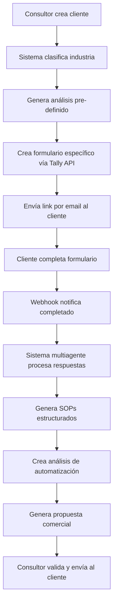

# PRD - Levantamiento SOP
# 📋 PRD: Sistema de Levantamiento Automatizado de Procesos
## Template Optimizado para Máxima Automatización con Natural Language Rules

---

## 📌 INFORMACIÓN DEL PROYECTO

### **1.1 Identificación**
```yaml
nombre_proyecto: "Sistema de Levantamiento Automatizado de Procesos Empresariales"
codigo_proyecto: "SLAP-2025-001"
version_prd: "1.0.0"
fecha: "2025-08-05"
autor: "Empresa Consultora de Automatización"
industria: "consultoría"
```

### **1.2 Contexto Empresarial**
```markdown
## Descripción de la Empresa
Somos una empresa de consultoría especializada en automatización de procesos empresariales. Atendemos principalmente a PYMEs y empresas medianas en Latinoamérica, ayudándolas a identificar, documentar y automatizar sus procesos operativos. Nuestro equipo está compuesto por consultores especializados en diferentes industrias y un sistema multiagente de IA existente.

## Problema a Resolver
Actualmente, el levantamiento de procesos empresariales es manual, toma semanas de trabajo y es costoso tanto para nosotros como para nuestros clientes. Las empresas no tienen sus procesos documentados o los conocen superficialmente, lo que dificulta identificar oportunidades de automatización. No existe una metodología escalable que nos permita generar diagnósticos y propuestas de automatización de manera eficiente y estandarizada por industria.

## Impacto Esperado
- Reducción de costos: 80% del tiempo de diagnóstico
- Ahorro de tiempo: De 3-4 semanas a 3-5 días
- Mejora en precisión: 90% satisfacción en SOPs generados
- ROI esperado: $50K+ en pipeline de propuestas en 6 meses
```

---

## 🎯 OBJETIVOS Y ALCANCE

### **2.1 Objetivo Principal**
Automatizar completamente el proceso de levantamiento y documentación de procesos empresariales mediante formularios adaptativos impulsados por IA, generando SOPs estructurados y propuestas de automatización en días en lugar de semanas.

### **2.2 Objetivos Específicos**
- [ ] Automatizar la generación de formularios específicos por industria y tamaño de empresa
- [ ] Integrar sistema multiagente existente para procesar respuestas y generar SOPs
- [ ] Crear propuestas de automatización con análisis de factibilidad
- [ ] Establecer pipeline de 50+ clientes procesados en 6 meses

### **2.3 Alcance**
```yaml
incluye:
  - "Dashboard de gestión de clientes y proyectos"
  - "Sistema de formularios adaptativos con Tally Forms API"
  - "Base de conocimiento de 13 industrias prioritarias"
  - "Integración con sistema multiagente de IA existente"
  - "Generación automática de SOPs y propuestas"

no_incluye:
  - "Automatización real de procesos del cliente"
  - "Desarrollo del sistema multiagente (ya existe)"
  - "Soporte multiidioma (solo español MVP)"
  - "Mercados fuera de Latinoamérica"
  
usuarios_target:
  primarios: "Equipo interno de consultores (yo y mi equipo)"
  secundarios: "Clientes empresariales que completan formularios"
  cantidad_estimada: "5-10 consultores simultáneos, 50+ clientes/mes"
```

---

## 👥 USUARIOS Y STAKEHOLDERS

### **3.1 Perfiles de Usuario**
```yaml
usuario_1:
  rol: "Consultor Principal (Owner)"
  responsabilidades: "Gestión completa del proceso, análisis de resultados, propuestas comerciales"
  nivel_técnico: "alto"
  frecuencia_uso: "diario"
  pain_points:
    - "Tiempo excesivo en levantamiento manual"
    - "Falta de estandarización por industria"
    - "Dificultad para escalar el negocio"
  
usuario_2:
  rol: "Equipo de Consultores"
  responsabilidades: "Gestión de clientes específicos, validación de SOPs"
  nivel_técnico: "medio"
  frecuencia_uso: "diario"
  pain_points:
    - "Proceso manual repetitivo"
    - "Falta de templates estandarizadas"

usuario_3:
  rol: "Cliente Empresarial"
  responsabilidades: "Completar formularios de diagnóstico"
  nivel_técnico: "bajo"
  frecuencia_uso: "una vez"
  pain_points:
    - "Formularios largos y complejos"
    - "No comprende terminología técnica"
```

### **3.2 Stakeholders Clave**
- **Sponsor Ejecutivo**: Owner del negocio - Expectativas de ROI y escalabilidad
- **Champion del Proyecto**: Consultor líder - Responsable de validación técnica
- **IT/Sistemas**: Desarrollador principal - Integración con sistema multiagente existente

---

## 📦 REQUISITOS FUNCIONALES

### **4.1 Funcionalidades Core**

```markdown
## RF001: Gestión de Clientes y Clasificación Automática
**Como** consultor principal
**Quiero** crear y clasificar automáticamente clientes por industria
**Para** generar formularios específicos y relevantes

### Criterios de Aceptación:
- El sistema debe capturar datos básicos: nombre, industria, subindustria, tamaño, años operación
- Cuando se ingrese un cliente nuevo, entonces se debe clasificar automáticamente usando IA
- Se debe mostrar análisis pre-definido de procesos típicos de la industria
- Dashboard debe mostrar estado de todos los clientes

### Reglas de Negocio:
- RN1: "Clientes deben clasificarse en una de las 13 industrias prioritarias"
- RN2: "Análisis pre-definido se genera automáticamente basado en industria + tamaño"
- RN3: "Sistema debe alertar si industria no está en base de conocimiento"
```

```markdown
## RF002: Sistema de Formularios Adaptativos
**Como** sistema automatizado
**Quiero** generar formularios específicos basados en industria y características del cliente
**Para** recopilar información relevante sin redundancias

### Criterios de Aceptación:
- El sistema debe generar formularios únicos vía Tally Forms API
- Cuando se complete la clasificación del cliente, entonces se crea formulario específico
- Se debe permitir guardado parcial y reanudación (persistencia)
- Link único se envía automáticamente por email

### Reglas de Negocio:
- RN1: "Formularios micro: 15-20 preguntas | pequeñas: 20-25 | medianas: 25-30 | grandes: 30-40"
- RN2: "Industrias reguladas requieren preguntas adicionales de compliance"
- RN3: "Webhook debe notificar cuando formulario se complete"
```

```markdown
## RF003: Procesamiento Inteligente de Respuestas
**Como** consultor
**Quiero** que el sistema multiagente procese automáticamente las respuestas
**Para** generar SOPs estructurados sin intervención manual

### Criterios de Aceptación:
- El sistema debe procesar respuestas vía sistema multiagente existente
- Cuando se reciban respuestas, entonces se identifican procesos explícitos e implícitos
- Se debe generar SOPs estructurados para cada proceso identificado
- Párrafos explicativos deben permitir validación del cliente

### Reglas de Negocio:
- RN1: "Procesos identificados deben categorizarse: primarios, soporte, gestión"
- RN2: "SOPs deben seguir estructura estándar: objetivo, responsables, inputs, pasos, outputs"
- RN3: "Sistema debe generar mínimo 5 procesos por diagnóstico"
```

```markdown
## RF004: Análisis de Automatización y Propuestas
**Como** consultor comercial
**Quiero** generar propuestas automáticas de automatización
**Para** cerrar ventas más rápido con datos fundamentados

### Criterios de Aceptación:
- El sistema debe evaluar factibilidad de automatización por proceso
- Cuando se generen SOPs, entonces se crea matriz de priorización automática
- Se debe calcular estimaciones de costo y tiempo de implementación
- Propuesta comercial debe generarse en formato PDF

### Reglas de Negocio:
- RN1: "Matriz usa criterios: impacto vs esfuerzo, ROI estimado, complejidad técnica"
- RN2: "Procesos de alto volumen y repetitivos tienen prioridad alta automáticamente"
- RN3: "Propuestas incluyen cronograma en fases: Quick Wins (1-3 meses), Medium (3-6 meses), Complex (6+ meses)"
```

### **4.2 Matriz de Funcionalidades**
| ID | Funcionalidad | Prioridad | Usuario | Complejidad |
|----|--------------|-----------|---------|-------------|
| RF001 | Gestión de Clientes | Alta | Consultor Principal | Media |
| RF002 | Formularios Adaptativos | Alta | Sistema/Cliente | Alta |
| RF003 | Procesamiento IA | Alta | Sistema | Media |
| RF004 | Propuestas Automatizadas | Alta | Consultor Principal | Alta |
| RF005 | Dashboard y Reportes | Media | Consultores | Baja |
| RF006 | Notificaciones Automáticas | Media | Todos | Baja |

---

## ⚡ REQUISITOS NO FUNCIONALES

### **5.1 Performance**
```yaml
rendimiento:
  tiempo_respuesta: "<3s para consultas, <10s para generación de formularios, <2min para procesamiento IA"
  usuarios_concurrentes: "mínimo 10 consultores simultáneos"
  volumen_datos: "50 clientes/mes, 200 formularios completados/mes"
  crecimiento_esperado: "100% anual durante primeros 2 años"
```

### **5.2 Disponibilidad**
```yaml
disponibilidad:
  uptime_requerido: "99%"
  ventana_mantenimiento: "Domingos 2-6am GMT-5"
  recuperación_desastres: "RTO: 4h, RPO: 24h"
  backup_frecuencia: "Diario incremental, semanal completo"
```

### **5.3 Seguridad**
```yaml
seguridad:
  autenticación: "Usuario/password + 2FA para admin"
  autorización: "Roles granulares: Admin, Consultor, Cliente"
  encriptación: "AES-256 en reposo, TLS 1.3 en tránsito"
  compliance: "LGPD para datos de empresas latinoamericanas"
  auditoría: "Log completo de acciones sensibles (creación clientes, acceso datos)"
```

### **5.4 Usabilidad**
- Interfaz intuitiva sin capacitación técnica requerida
- Responsive design para móviles y tablets
- Soporte idioma: Español únicamente (MVP)
- Accesibilidad: Contraste alto, navegación por teclado

---

## 🔄 INTEGRACIONES

### **6.1 Sistemas Actuales**
```yaml
sistema_multiagente:
  nombre: "Sistema Multiagente IA Existente"
  version: "Actual"
  tipo_integración: "API REST"
  frecuencia: "Tiempo real"
  datos_intercambiados:
    - "Respuestas de formularios en JSON"
    - "Contexto de industria y empresa"
    - "SOPs generados estructurados"
    - "Análisis de automatización"
```

### **6.2 APIs Externas**
- **Tally Forms API**: Creación dinámica de formularios, gestión de webhooks - Sin límites de formularios/respuestas
- **Email Provider**: Envío de notificaciones y links - 1000 emails/mes incluidos
- **PDF Generator**: Generación de propuestas comerciales - Sin restricciones

---

## 📊 FLUJOS DE TRABAJO

### **7.1 Flujo Principal: Levantamiento Automatizado**


### **7.2 Estados y Transiciones**
```yaml
estados:
  - "cliente_creado": "Cliente registrado, esperando formulario"
  - "formulario_enviado": "Link enviado, esperando respuestas"
  - "respuestas_recibidas": "Formulario completado, esperando procesamiento"
  - "procesando_ia": "Sistema multiagente trabajando"
  - "sops_generados": "Documentación lista, esperando análisis"
  - "propuesta_lista": "Lista para envío comercial"
  - "propuesta_enviada": "Enviada al cliente"
  - "cerrado": "Proceso completado o cancelado"

transiciones_permitidas:
  cliente_creado: [formulario_enviado, cancelado]
  formulario_enviado: [respuestas_recibidas, expirado]
  respuestas_recibidas: [procesando_ia]
  procesando_ia: [sops_generados, error_procesamiento]
  sops_generados: [propuesta_lista]
  propuesta_lista: [propuesta_enviada]
```

---

## 🎯 REGLAS DE NEGOCIO ESPECÍFICAS

### **8.1 Reglas de Formularios Adaptativos**
```yaml
seleccion_preguntas:
  - RULE: "Empresas micro (<10 empleados): Enfocar en procesos manuales básicos y crecimiento"
  - RULE: "Empresas pequeñas (10-50): Incluir procesos de escalabilidad y sistematización"
  - RULE: "Empresas medianas (50-200): Agregar integración entre departamentos y KPIs"
  - RULE: "Empresas grandes (200+): Incluir procesos complejos, legacy systems y compliance"
  - RULE: "Industrias reguladas (salud, finanzas): Agregar 5-10 preguntas de compliance adicionales"
```

### **8.2 Reglas de Priorización Automática**
```yaml
matriz_automatizacion:
  - RULE: "Procesos con >100 transacciones/mes y >10 pasos manuales = Prioridad ALTA"
  - RULE: "Procesos con errores frecuentes (>5% tasa error) = Impacto ALTO"
  - RULE: "Procesos que requieren integración con >3 sistemas = Complejidad ALTA"
  - RULE: "ROI estimado >300% = Incluir en Quick Wins (0-3 meses)"
  - RULE: "Procesos críticos para compliance = Forzar prioridad ALTA independiente de otros factores"
```

### **8.3 Reglas de Validación de Calidad**
```yaml
calidad_sops:
  - RULE: "Cada SOP debe tener mínimo: objetivo, 1 responsable, 3 pasos, inputs/outputs claros"
  - RULE: "Procesos identificados <5 por empresa = Alertar para revisión manual"
  - RULE: "SOPs con >20 pasos = Sugerir división en sub-procesos"
  - RULE: "Empresas sin procesos primarios identificados = Escalación manual obligatoria"
```

---

## 🛠️ STACK TECNOLÓGICO RECOMENDADO

### **9.1 Arquitectura Sugerida**
```yaml
arquitectura:
  tipo: "Monolítica con microservicios específicos"
  
frontend:
  framework: "React/Next.js"  # Para dashboard interno
  ui_library: "Tailwind CSS + shadcn/ui"
  state_management: "Zustand para estado global"
  
backend:
  lenguaje: "Node.js/TypeScript"
  framework: "Express.js con estructura modular"
  orm: "Prisma con PostgreSQL"
  
database:
  principal: "PostgreSQL (Supabase)"  # Incluye auth y storage
  cache: "Redis para sesiones y cache de formularios"
  
hosting:
  frontend: "Vercel"  # Deploy automático desde Git
  backend: "Railway"  # Para API y procesamiento
  database: "Supabase"  # PostgreSQL + Auth + Storage
  
integraciones:
  workflows: "n8n para webhooks y automatizaciones"
  queues: "BullMQ para procesamiento asíncrono de IA"
  monitoring: "Sentry + Vercel Analytics"
  
apis_externas:
  formularios: "Tally Forms API"
  email: "Resend o SendGrid"
  pdf: "Puppeteer para generación PDFs"
```

### **9.2 Consideraciones Técnicas**
- **Escalabilidad**: Arquitectura modular preparada para 10X crecimiento
- **Modularidad**: Separación clara entre gestión clientes, formularios, procesamiento IA
- **Testing**: Coverage mínimo 80% en lógica de negocio crítica
- **CI/CD**: GitHub Actions con deploy automático a staging/production

---

## 📈 MÉTRICAS DE ÉXITO

### **10.1 KPIs Técnicos**
- Tiempo de generación de formulario: <30 segundos
- Tiempo de procesamiento IA: <2 minutos
- Disponibilidad del sistema: >99%
- Tasa de error en generación SOPs: <5%

### **10.2 KPIs de Negocio**
- **MVP (3 meses)**: 10 clientes piloto procesados exitosamente
- **Phase 2 (6 meses)**: 50+ clientes procesados, pipeline $50K+
- **Reducción tiempo diagnóstico**: De 3-4 semanas a 3-5 días (80%+ mejora)
- **Satisfacción SOPs generados**: >90% aprobación cliente
- **ROI del sistema**: Recuperar inversión en 8 meses

### **10.3 KPIs de Adopción**
- Tasa de completado de formularios: >85%
- Tiempo promedio completado: <45 minutos
- Tasa de conversión propuesta → proyecto: >25%

---

## 📅 FASES DEL PROYECTO

### **11.1 Phase 1 - MVP Core (6-8 semanas)**
- [ ] Dashboard básico de gestión de clientes
- [ ] Integración con Tally Forms API
- [ ] Base de conocimiento de 3 industrias (Contabilidad, Inmobiliaria, Ventas)
- [ ] Integración con sistema multiagente existente
- [ ] Generación básica de SOPs

### **11.2 Phase 2 - Automatización Completa (6 semanas)**
- [ ] Implementar 13 industrias completas
- [ ] Sistema de propuestas automáticas
- [ ] Matriz de priorización y ROI
- [ ] Dashboard avanzado con analytics
- [ ] Notificaciones automáticas

### **11.3 Phase 3 - Optimización y Escala (Ongoing)**
- [ ] Machine learning para mejorar clasificación
- [ ] Reportes avanzados y business intelligence
- [ ] Optimización de costos y performance
- [ ] Expansión a nuevas industrias/mercados

---

## 🎨 MOCKUPS Y DISEÑOS

### **12.1 Pantallas Principales**

1. **Dashboard Principal**
   - Métricas resumen: clientes activos, formularios completados, propuestas generadas
   - Lista de clientes con estados y acciones rápidas
   - Notificaciones de formularios completados y errores
   - Acceso rápido a crear nuevo cliente

2. **Perfil de Cliente**
   - Información básica y clasificación de industria
   - Análisis pre-definido de procesos típicos de la industria
   - Estado del formulario y link de acceso
   - SOPs generados con opciones de edición
   - Propuesta de automatización con descarga PDF

3. **Gestión de Base de Conocimiento**
   - Industrias configuradas con procesos típicos
   - Templates de preguntas por industria y tamaño
   - Pain points comunes y herramientas estándar
   - Benchmarks de automatización

---

## 📝 CONSIDERACIONES FINALES

### **13.1 Riesgos y Mitigaciones**
| Riesgo | Probabilidad | Impacto | Mitigación |
|--------|--------------|---------|------------|
| API Tally Forms inestable | Media | Alto | Implementar fallback con formularios propios + monitoreo activo |
| Calidad SOPs generados baja | Media | Alto | Validación humana en MVP + mejora iterativa del prompt engineering |
| Resistencia clientes a formularios largos | Alta | Medio | Gamificación + progreso visual + guardado parcial |
| Integración sistema multiagente compleja | Baja | Alto | Pruebas extensivas + documentación API detallada |

### **13.2 Supuestos**
- Sistema multiagente existente tiene API estable y documentada
- Tally Forms API mantiene disponibilidad >99% según SLA
- Clientes están dispuestos a invertir 45-60 minutos completando formulario
- Base de conocimiento inicial será suficiente para generar valor inmediato

### **13.3 Restricciones**
- Presupuesto máximo: $25,000 para MVP
- Fecha límite MVP: 8 semanas desde inicio desarrollo
- Tecnologías mandatorias: Integración con Tally Forms, sistema multiagente existente
- Mercado inicial: Solo Latinoamérica, solo español

---

## 🔄 INDUSTRIAS PRIORITARIAS - BASE DE CONOCIMIENTO

### **13.4 Lista Completa de Industrias MVP**
1. **Contabilidad** (Contabilidad PYME, Corporativa, Auditoría, Asesoría Tributaria)
2. **Gestión Inmobiliaria** (Desarrollo Residencial, Comercial, Corretaje, Administración)
3. **Prospección y Ventas** (B2B SaaS, B2B Servicios, B2C Retail, E-commerce)
4. **Agrícola** (Cultivos Extensivos, Fruticultura, Ganadería, Agroindustria)
5. **Licitaciones** (Obras Públicas, Servicios Públicos, Consultoría Gubernamental)
6. **Startups TI** (SaaS, Fintech, E-commerce, Desarrollo Software)
7. **Consultas Médicas** (Medicina General, Especialidades, Telemedicina, Centros)
8. **Telecomunicaciones** (ISP, Telefonía, Instalaciones, Soporte Técnico)
9. **Energía Solar** (Residencial, Comercial, Industrial, Mantención)
10. **Hotelería** (Hoteles, Hostales, Apart-hoteles, Turismo Rural)
11. **Consultoría** (Estratégica, TI, RRHH, Procesos)
12. **Venta Masiva** (Retail, Distribución, FMCG, Marketplace)
13. **Arquitectura** (Residencial, Comercial, Industrial, Paisajismo)

---

## ✅ CHECKLIST DE COMPLETITUD

Verificación final del PRD:
- [x] Todos los campos obligatorios están completos
- [x] Los requisitos son específicos y medibles con criterios SMART
- [x] Las reglas de negocio incluyen automatizaciones por industria y tamaño
- [x] El stack tecnológico está alineado con Tally Forms API y sistema multiagente
- [x] Los KPIs son realistas y medibles (80% reducción tiempo, 90% satisfacción)
- [x] Las fases están definidas con entregables concretos
- [x] Se incluyen 13 industrias específicas para base de conocimiento

---

**💡 AUTOMATIZACIONES CLAVE IDENTIFICADAS:**

1. **Clasificación automática** de clientes por industria usando IA
2. **Generación dinámica** de formularios vía Tally Forms API según industria + tamaño
3. **Procesamiento inteligente** de respuestas para identificar procesos implícitos
4. **Generación automática** de SOPs siguiendo templates por industria
5. **Análisis de factibilidad** automatizado con matriz impacto vs esfuerzo
6. **Propuestas comerciales** generadas automáticamente en PDF
7. **Notificaciones automáticas** en cada fase del proceso
8. **Webhooks de Tally** para trigger de procesamiento sin intervención manual

El sistema Queen Agent CTO V8 podrá extraer estas reglas automáticamente y generar un sistema completamente autónomo de levantamiento de procesos empresariales.